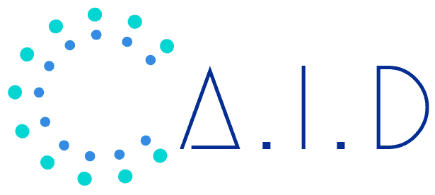

<!-- PROJECT LOGO -->
 

  

  <h3 align="center">A.I.D</h3>

  

    Aid your entire A.I activity.
     
    <a href="https://aid.autoai.org"><strong>Explore the docs »</strong></a>
     
     
    <a href="https://www.youtube.com/watch?v=0TU28hkx7KE&t=33s">Video Demo</a>
    ·
    <a href="https://github.com/autoai-org/aid/issues">Report Bug</a>
    ·
    <a href="https://github.com/autoai-org/aid/issues">Request Feature</a>
    ·
    <a href="https://github.com/autoai-org/aid/issues">Read the Story</a>
  

<!-- TABLE OF CONTENTS -->
## Table of Contents

* [Usage](#usage)
* [Roadmap](#roadmap)
* [Contributing](#contributing)
* [License](#license)

<!-- USAGE EXAMPLES -->
## Usage

For more examples, please refer to the [Documentation](https://aid.autoai.org).

<!-- ROADMAP -->
## Roadmap

See the [open issues](https://github.com/autoai-org/aid/issues) for a list of proposed features (and known issues).

<!-- CONTRIBUTING -->
## Contributing

Contributions are what make the open source community such an amazing place to be learn, inspire, and create. Any contributions you make are **greatly appreciated**.

1. Fork the Project
2. Create your Feature Branch (`git checkout -b feature/AmazingFeature`)
3. Commit your Changes (`git commit -m 'Add some AmazingFeature'`)
4. Push to the Branch (`git push origin feature/AmazingFeature`)
5. Open a Pull Request

<!-- LICENSE -->
## License

Personal use are governed by the MIT License. See `LICENSE` for more information.

## Credit

CVFlow is impossible to be made without the help from the community. We would love to express our sincere gratitude to the following organizations and individuals for their kind support:

* [AICAMP.CO.,LTD](https://autoai.org) for becoming the umbrella company of CVFlow (and many other open software).
* [Cyberport.hk](https://cyberport.hk) for providing incubation programme for our projects.
* [Shenzhen University](https://www.szu.edu.cn) for providing lots of general help.
* [Oregon State University Open Source Lab](https://osuosl.org/) for hosting open source and some public models.
* [Netlify](https://www.netlify.com/) for hosting our static websites.
* [Amazon Web Services](https://aws.amazon.com) for providing general web services.
* [DiDi Cloud](https://www.didiyun.com/?channel=14204) for providing cloud services.

In case you are interested, and if this project helps you or your company, you could make a small donation or become a long-term sponsor at our [Open Collective](http://opencollective.com/autoai).
