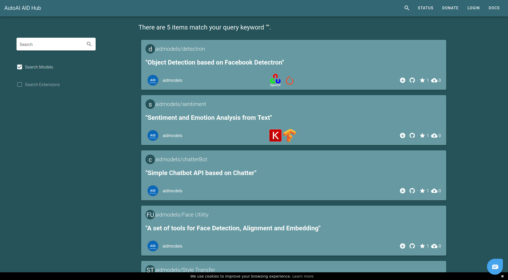
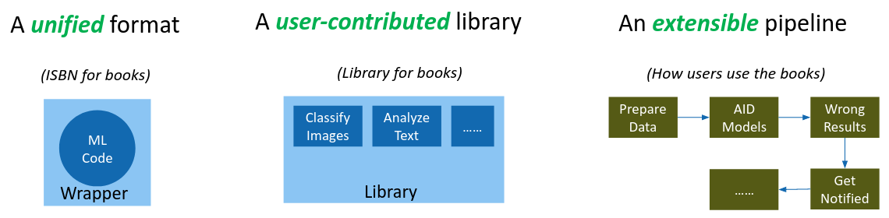

# Overview

The project AID aims to remove the common barriers to using machine learning algorithms. It provides a digital library and a package manager for searching, downloading and running machine learning models. With AID, software developers are enabled to perform ML experiments and apply ML algorithms in a unified and systematic way.

Over the years, machine learning has been widely used in many different fields. Numerous libraries, frameworks and systems have been invented to develop ML-driven applications. However, the popularity of ML has still not done enough to ease the process of running ML algorithms; both for ML experts and other software engineers.

When scientists need to reproduce and evaluate ML algorithms, they have to manually find out and install the dependencies and any other requirements to run the algorithm. If they need to evaluate several different algorithms and compare the results, they have to repeat the process several times, which is tedious and time-consuming. At the same time, software engineers are increasingly expected to have more ML knowledge and the technical skills to apply ML algorithms, which is not always possible and can be inefficient.

In order to make the usage of ML algorithms more systematic, AID imitates libraries for books and proposes three components. First, like the ISBN for books, AID provides a unified format for different ML models, such that these models can be read, extracted and indexed in the same way. Secondly, AID maintains a digital library where users are enabled to search, filter and inspect existing ML models. Last but not least, like checking out a copy of a book, AID allows users to download, install and run ready-to-use ML algorithms, all in a unified way with a package manager that handles the algorithms dependencies. An extensible pipeline allows these existing ML algorithms from the platform to be easily integrated into existing machine learning systems.

With AID, the application of ML algorithms can made more accessible in the following way. First, the whole team can search for established ML algorithms in the library, and then the software engineers deploy the models and upload a test dataset. Finally, experts from the domain (e.g. biologists, doctors) can examine and explain the results before making a final decision on implementing the algorithm. 
The main advantage of using AID is twofold: The process for evaluating different ML algorithms becomes more consistent, and developers can run the ML algorithms using the same short steps. These two improvements could reduce the barriers to applying ML algorithms significantly. 

## Difference from Other Projects

Most other projects simply collect the model weights and some code to load the weights and run the inference on the weights. As a contrast, AID enforces these models to follow a special format, such that AID could extract information about the models, and direct the users to run the inference process without reading the code and understand everything.

The center of AID project are models, and everything else is built on top of these models. The unified interface ensures other components to be able to access the models.