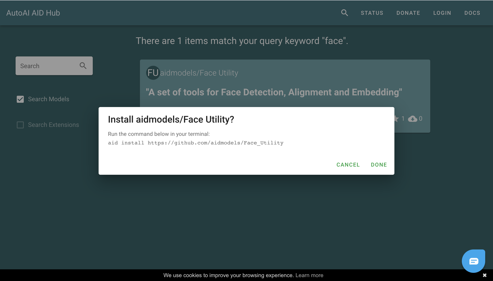

<iframe width="807" height="400" src="https://www.youtube.com/embed/WlzcsxEG_PU" title="YouTube video player" frameborder="0" allow="accelerometer; autoplay; clipboard-write; encrypted-media; gyroscope; picture-in-picture" allowfullscreen></iframe>

The above video demonstrates how to use AID to search for, download, install, build and deploy a machine learning model. In this quick start guide, we will go through the process and explain what is done during this process.

## Search Models


All published AID models can be obtained at [AID Hub](https://hub.autoai.org). You can search your needed models by keyowords on search bar. Or click the search button on search bar directly to explore all our exsiting models freely.


## Download and Install

After finding the desired model, click the corresponding download button, and then the related command will showed. Copy the command and run it below in your terminal to install the package of the model.



You can use ```aid list packages``` command to show all installed packages and run ```aid help [package ID]``` to learn the detailed information, such as solver name, and how to use the model.

## Build Image and Container

After installing the packages, you need to build it into an image which consists of all dependencies, pretrained model and source code. Use ```aid build [vendor name]/[package name]/[solver name]``` to build image. Once finished, it will return a reference number for the built image. You can check images by running ```aid list images```.

Now, you can start to create a corresponding container that bind the local IP to this image. Use ```aid create [image ID] [port number]``` to create a container. A container ID will be given if succeeded. You can also check the ID by ```aid list containers``` command.

## Deplo to HTTP Service

To start the container, ```aid start [container ID]``` will help to deploy HTTP service to the specified port number. Now you can check if the contianer run on the port successfully by using ```aid list containers```. If running properly, the status of Running will be TRUE.

## Test the Model

Now you can test the model by ```aid infer [container ID] [argument]="content/path"```. The solver will give the results. You can use ```aid help [package ID]``` to check the meaning of results.