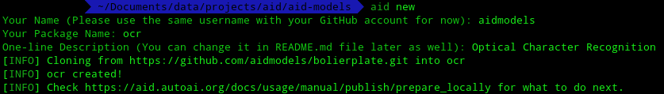
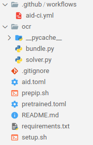

:::caution
Before you start, make sure you have at least installed [git](https://git-scm.com/), [Docker](https://docs.docker.com/get-docker/) and the [AID command line utility](https://aid.autoai.org/docs/getting-started/installation). The desktop GUI is not required and will not be used in this process.
:::

## Step 1: Download Project Template

First switch into a folder where you want to put all your models in and then run the ```aid new``` command. AID will prompt you to input some information about the new model, as shown below:



:::note
AID will automatically create a new folder when download the template, so there is no need to create the folder beforehand.
:::

## Step 2: Modify the Solvers

After downloading the template, AID will generate a folder with the structure below:



where the folder ```ocr``` is the package name that you have specified in the previous step.

A sample solver is provided in ```ocr/solver.py```, with the content as shown below:

```python
from mlpm.solver import Solver

class SampleSolver(Solver):
    def __init__(self, toml_file=None):
        super().__init__(toml_file)
        # Do you Init Work here
        self.classifer = get_classifier()
        self.ready()
    def infer(self, data):
        # if you need to get file uploaded, get the path from input_file_path in data
        image = load_image(data['input_file_path'])
        result = self.classifier(image)
        return result # return a dict
```

You can now modify the constructor ```__init__``` function and the ```infer``` function as you wish. 

* The constructor is supposed to load the pretrained models, and initialise all parameters that needs to be loaded.
* The ```infer``` function is supposed to read the input parameter ```data```, perform the inference process and return the results.

You can also change the name of the class, but make sure to update it in your ```aid.toml``` file.

:::note
* Currently the solver can only receive one file at a time, with the request parameter ```file```. AID will automatically handle the uploading process and save the file to a temporary folder. 
* Please describe in the ```README.md``` file what input is needed by the solver and how to interpret the results.
* If the solver relies on some pretrained weights, you can specify them in the ```pretrained.toml``` file. For more information you can take a look at the specification [here](/docs/specs/configurations#pretrainedtoml).
:::

## Step 3: Checklist

After modifying everything, you can quickly check if the following requirements are met:

* The solver class in your ```aid.toml``` file should be readable by Python program, i.e. it should has the following format ```{packageName}/solver/{className}``` where ```packageName``` should be replaced by the package name that you have speicified before and ```{className}``` is the name of the class that you modified in step 2.

* If the pretrained weights are needed, the weights should be uploaded to somewhere accessbile to users.

* All requirements should be noted in ```requirements.txt```.

* If additional software is needed, they should be noted in ```setup.sh```. In this file you can write commands like ```apt-get install xxx``` to install additional dependencies that cannot be installed by ```pip```.

* Required request parameters and the meaning of output should be written in the ```README.md``` file.